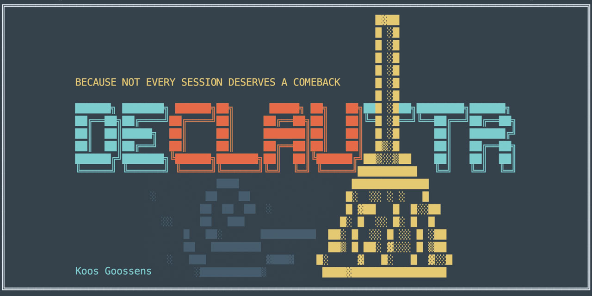
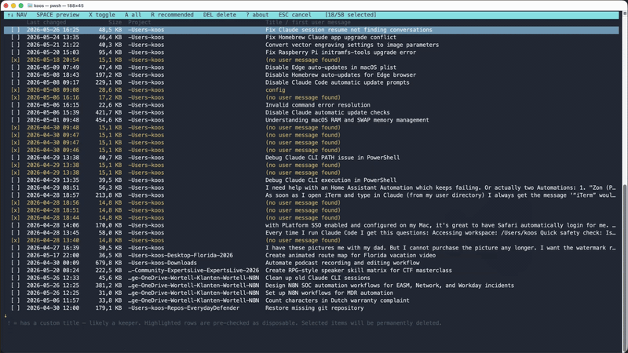

# DeClauttR



A small PowerShell utility to **list and prune Claude Code sessions** that pile up
under `~/.claude/projects/` and clutter the `claude --resume` picker.

`/clear` inside a Claude session only wipes the in-memory context — it does
**not** delete the on-disk transcript, so old sessions keep showing up in the
resume list forever. **DeClauttR** lets you see what's there (with the same
titles Claude shows you in `--resume`) and bulk-delete the ones you don't
want anymore.

Cross-platform: works on **macOS, Linux, and Windows** under PowerShell 7+ (`pwsh`).



## Features

- Walks every project directory under `~/.claude/projects/` and lists each session with:
  - timestamp
  - UUID (the filename — same one `claude --resume` shows internally)
  - size on disk
  - session **title** (custom title set via `/title`, or the AI-generated one)
  - first real user prompt, word-wrapped to the terminal width
- Two display modes:
  - **Interactive picker** (default) — full-screen checkbox TUI with arrow-key
    navigation, viewport scrolling, and a confirmation step before any file is touched.
  - **List mode** (`-List`) — grouped per project, scroll-friendly text output.
- **Auto-recommends** likely-disposable sessions and pre-checks them, including:
  - sessions with no real user message (empty/aborted starts)
  - sessions under 20 KB
  - one-word prompts like `resume`, `config`, `exit`, `help`, `init`
  - prompts shorter than 15 characters
- **Highlights keepers in cyan**: sessions with a user-assigned custom title
  (set via `/title`) are rendered in cyan and marked with a leading `!` to
  flag the ones you most likely want to hold on to.
- Safe by default: nothing is deleted without an explicit, case-sensitive `YES` confirmation.

## Requirements

- **PowerShell 7 or later** (also known as **PowerShell Core** / `pwsh`).
  The script uses syntax and APIs that don't exist in the old Windows
  PowerShell 5.1 that ships with Windows by default, so it **must** be run
  under `pwsh`.
  - Windows: install from the [PowerShell releases page](https://github.com/PowerShell/PowerShell/releases)
    or via `winget install Microsoft.PowerShell`.
  - macOS: `brew install --cask powershell`.
  - Linux: see the [PowerShell install docs](https://learn.microsoft.com/powershell/scripting/install/installing-powershell-on-linux).
- A terminal that supports ANSI cursor positioning for the interactive
  picker — Windows Terminal is the recommended choice on Windows. iTerm2,
  macOS Terminal, and most Linux terminals also work fine.

## Install

Clone the repo:

```powershell
git clone https://github.com/TheCloudScout/declauttr.git
cd declauttr
```

Run it from there:

```powershell
pwsh ./Declauttr.ps1
```

### Optional: a shell alias

Drop this into your PowerShell profile (`pwsh -c 'code $PROFILE'` to open it)
so you can call `declauttr` from any directory:

```powershell
function declauttr { & "C:\path\to\declauttr\Declauttr.ps1" @args }
```

(On macOS / Linux substitute the appropriate path, e.g.
`"$HOME/declauttr/Declauttr.ps1"`.)

## Usage

### Open the interactive picker (default)

```powershell
./Declauttr.ps1
```

### List every session, grouped per project

```powershell
./Declauttr.ps1 -List
```

Output looks like:

```
=== -Users-koos-Repos-myrepo (7 sessions) ===
  2026-05-26 15:49  f870f835-0044-4439-b510-e0960748d4b1   2,139.0 KB
     Refactor auth middleware
     I want to refactor the auth middleware so that token validation happens
     before the rate limiter instead of after, since invalid tokens are…
  2026-05-26 15:34  a09f73dc-e060-4a6b-b741-51100cb08a5b      17.2 KB
     (no user message found)
```

### Filter to one project (substring match)

```powershell
./Declauttr.ps1 -Project myrepo
```

### Interactive picker

The picker is the default. Pass `-List` if you want plain text output instead.

| Key | Action |
|---|---|
| ↑ / ↓ | move cursor |
| Home / End | jump to top / bottom |
| PgUp / PgDn | page up / down |
| **Space** | open a preview overlay for the highlighted session — session details (project, UUID, title, timestamp, size) stay pinned at the top of the window while the message body scrolls. Drop-shadow renders the underlying picker text in dim grey, like a classic Turbo Vision dialog. Space/Esc to close, ↑↓/PgUp/PgDn to scroll. |
| **X** | toggle the current row's checkbox |
| **A** | toggle all (check all, or uncheck if everything was checked) |
| **R** | re-apply the "recommended for removal" selection |
| **Del** / **Backspace** | open the delete-confirmation overlay for the checked rows. Type `yes` (case-insensitive) + Enter to commit, or Esc to back out. (On a MacBook without a numpad the "delete" key sends Backspace — both work here.) |
| **?** | open the about / help overlay with the DeClauttR logo and an auto-scrolling blurb. Any key closes it. |
| **Esc** / **Q** | cancel, nothing is touched |

Yellow rows are the ones DeClauttR recommends pruning. They start pre-checked,
so for the common case you can just review and press **Enter**. Rows rendered
in **cyan** with a leading `!` have a user-assigned custom title (set via
`/title`) — DeClauttR treats those as likely keepers, so you can spot them at
a glance and avoid deleting them by accident.

When the session list doesn't fit on screen, a yellow `↑` appears at the
top-left of the viewport if there are rows above it, and a yellow `↓` at
the bottom-left if there are rows below.

### Tune the snippet length

```powershell
./Declauttr.ps1 -SnippetLength 250
```

Affects how much of the first user message is shown in list mode (interactive
mode always uses the title, falling back to a truncated snippet).

### Point at a different Claude root (rare)

```powershell
./Declauttr.ps1 -ProjectsRoot "/some/other/path/.claude/projects"
```

## How it works

Each Claude Code session is stored as a JSONL transcript at:

```
~/.claude/projects/<encoded-cwd>/<session-uuid>.jsonl
```

The script streams each file with `[System.IO.File]::ReadLines`, fast-filters
lines with `String.Contains`, and only parses the few entry types it needs:

| Entry type | What DeClauttR uses it for |
|---|---|
| `user` | first real user message → snippet |
| `ai-title` | last value seen → fallback title |
| `custom-title` | last value seen → preferred title (overrides `ai-title`) |

System messages, slash-command echoes (`<command-name>…`), and local-command
caveats are skipped so the snippet always reflects the first **real** thing
you asked Claude.

Deletion is a plain `Remove-Item -Force` on the matching `.jsonl` file —
the same as if you'd deleted it by hand. Claude Code rebuilds its resume
list from the directory contents on next launch, so the deleted sessions
disappear immediately.

## Safety

- The interactive picker never deletes anything until you type `YES`
  (case-sensitive) at the confirmation prompt.
- The script never touches `~/.claude/projects/*/memory/` or any subdirectory
  that isn't a `.jsonl` file — your auto-memory store is left alone.
- Output is read-only until the final confirmation step. Esc/Q at any point
  exits cleanly.

## License

MIT.
