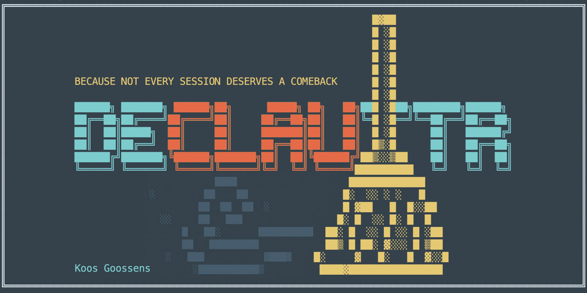
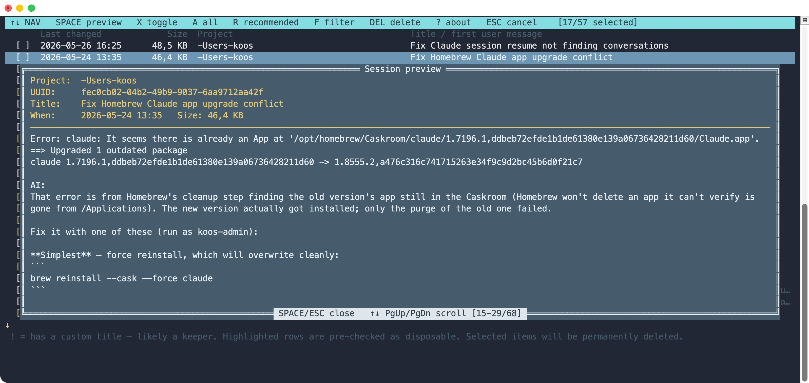
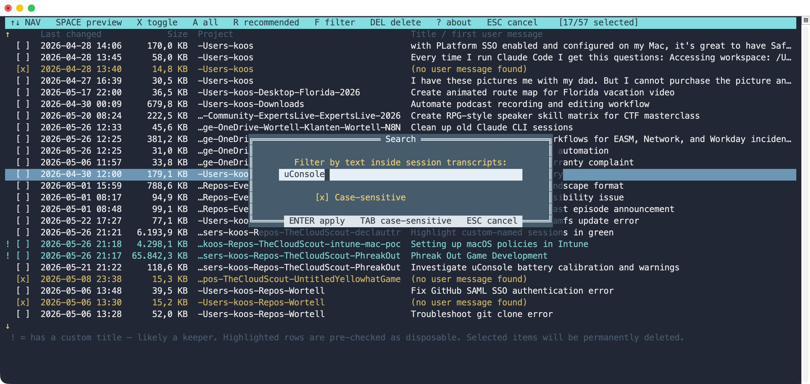
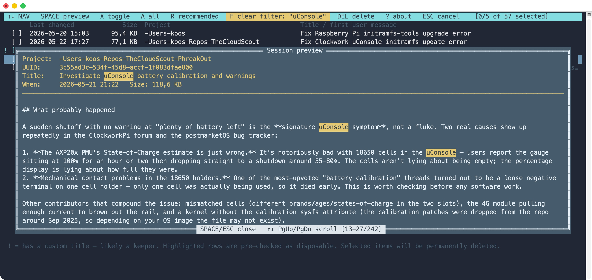
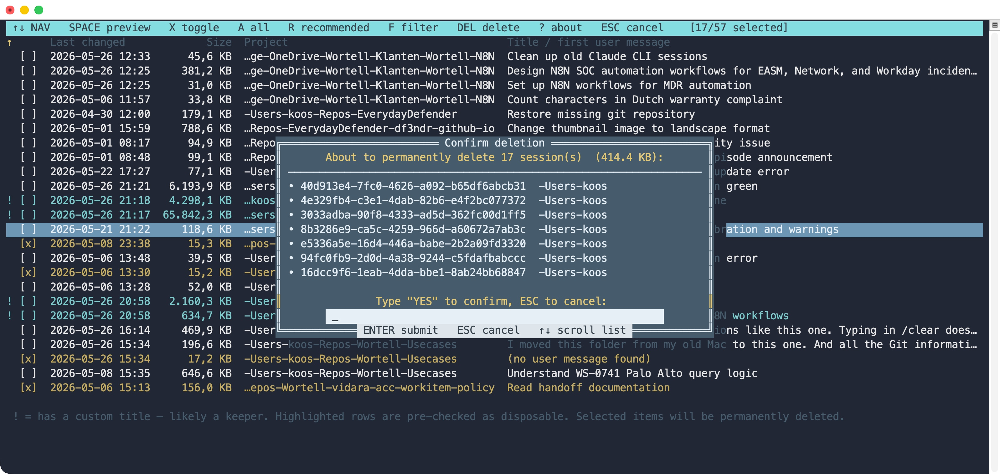

# DeClauttR



A small PowerShell utility to **list and prune Claude Code sessions** that pile up
under `~/.claude/projects/` and clutter the `claude --resume` picker.

`/clear` inside a Claude session only wipes the in-memory context — it does
**not** delete the on-disk transcript, so old sessions keep showing up in the
resume list forever. **DeClauttR** lets you see what's there (with the same
titles Claude shows you in `--resume`) and bulk-delete the ones you don't
want anymore.

Cross-platform: works on **macOS, Linux, and Windows** under PowerShell 7+ (`pwsh`).


## Features

- Walks every project directory under `~/.claude/projects/` and lists each session with:
  - timestamp
  - UUID (the filename — same one `claude --resume` shows internally)
  - size on disk
  - session **title** (custom title set via `/title`, or the AI-generated one)
  - first real user prompt, word-wrapped to the terminal width
- **Interactive picker** — full-screen checkbox TUI with arrow-key
    navigation, viewport scrolling, and a confirmation step before any file is touched.
- **Auto-recommends** likely-disposable sessions and pre-checks them, including:
  - sessions with no real user message (empty/aborted starts)
  - sessions under 20 KB
  - one-word prompts like `resume`, `config`, `exit`, `help`, `init`
  - prompts shorter than 15 characters
- **Highlights keepers in cyan**: sessions with a user-assigned custom title
  (set via `/title`) are rendered in cyan and marked with a leading `!` to
  flag the ones you most likely want to hold on to.
- **Rename from the preview**: press **R** inside a session preview to set a
  custom title without leaving DeClauttR — useful for promoting a spot-on
  AI-generated title to a custom one (so the row becomes a `!`-flagged
  keeper) or for relabelling a session into something you'll recognise later.
- **Jump into a session**: press **J** (then **J** again to confirm) to leave
  DeClauttR and drop straight back into the highlighted conversation via
  `claude --resume`, with the working directory restored. Works from the list
  and from inside the preview.
- Safe by default: nothing is deleted without an explicit `yes` (case-insensitive) confirmation, and the picker stays open after a delete so you can keep pruning instead of being kicked back to the shell.

## Requirements

- **PowerShell 7 or later** (also known as **PowerShell Core** / `pwsh`).
  The script uses syntax and APIs that don't exist in the old Windows
  PowerShell 5.1 that ships with Windows by default, so it **must** be run
  under `pwsh`.
  - Windows: install from the [PowerShell releases page](https://github.com/PowerShell/PowerShell/releases)
    or via `winget install Microsoft.PowerShell`.
  - macOS: `brew install --cask powershell`.
  - Linux: see the [PowerShell install docs](https://learn.microsoft.com/powershell/scripting/install/installing-powershell-on-linux).
- A terminal that supports ANSI cursor positioning for the interactive
  picker — Windows Terminal is the recommended choice on Windows. iTerm2,
  macOS Terminal, and most Linux terminals also work fine.

## Install

Clone the repo:

```powershell
git clone https://github.com/TheCloudScout/declauttr.git
cd declauttr
```

Run it from there:

```powershell
pwsh ./Declauttr.ps1
```

### Optional: a shell alias

Drop this into your PowerShell profile (`pwsh -c 'code $PROFILE'` to open it)
so you can call `declauttr` from any directory:

```powershell
function declauttr { & "C:\path\to\declauttr\Declauttr.ps1" @args }
```

(On macOS / Linux substitute the appropriate path, e.g.
`"$HOME/declauttr/Declauttr.ps1"`.)

## Usage

### Open the interactive picker (default)

```powershell
./Declauttr.ps1
```

### Filter to one project (substring match)

```powershell
./Declauttr.ps1 -Project myrepo
```

### Interactive picker

> **Project names use hyphens, not slashes.** Claude stores each session
> under a directory whose name is the original working directory with
> path separators (`/` on macOS/Linux, `\` on Windows) replaced by `-`.
> So your checkout at `/Users/koos/Repos/myrepo` shows up as
> `-Users-koos-Repos-myrepo` in the interactive picker's "Project" column.
> DeClauttR shows the name as Claude stored it rather
> than trying to decode the hyphens — `-` is also a valid character in
> folder names (`my-repo` would be indistinguishable from a path
> boundary), so the raw encoded form is the only unambiguous one.

| Key | Action |
|---|---|
| ↑ / ↓ | move cursor |
| Home / End | jump to top / bottom |
| PgUp / PgDn | page up / down |
| **Space** | open a preview overlay for the highlighted session — session details (project, UUID, title, timestamp, size) stay pinned at the top of the window while the message body scrolls. Drop-shadow renders the underlying picker text in dim grey, like a classic Turbo Vision dialog. Space/Esc to close, ↑↓/PgUp/PgDn to scroll, **R** to rename (see below). When a search filter is active (see **F** below), every occurrence of the search string is highlighted in the preview with a yellow background so you can scroll straight to the matches. |
| **J** | jump into the highlighted session: quit DeClauttR and resume it with `claude --resume`, after changing into the session's original working directory (recovered from the transcript). Press **J** once for a confirmation popup, then **J** again to confirm — any other key cancels. Also available from inside the preview. If the directory no longer exists or `claude` isn't on your `PATH`, DeClauttR shows a brief notice and stays put. |
| **X** | toggle the current row's checkbox |
| **A** | toggle all (check all, or uncheck if everything was checked) |
| **R** | re-apply the "recommended for removal" selection |
| **F** | toggle a content-search filter. A small prompt overlays the picker for a substring; press **Enter** to apply, and the list narrows to sessions whose `.jsonl` transcript contains that string anywhere (user prompts, assistant replies, titles). The match is case-insensitive by default — press **Tab** inside the prompt to flip the `[ ] Case-sensitive` checkbox before applying (the choice sticks across searches). Press **F** again on the picker to clear the filter and return to the full list. While filtered, the top status bar swaps "F filter" for a yellow "F clear filter: …" pill so you can't forget you're looking at a subset. |
| **Del** / **Backspace** | open the delete-confirmation overlay for the checked rows. Type `yes` (case-insensitive) + Enter to commit, or Esc to back out. (On a MacBook without a numpad the "delete" key sends Backspace — both work here.) |
| **?** | open the about / help overlay with the DeClauttR logo and an auto-scrolling blurb. Any key closes it. |
| **Esc** / **Q** | cancel, nothing is touched |

Yellow rows are the ones DeClauttR recommends pruning. They start pre-checked,
so for the common case you can just review and press **Enter**. Rows rendered
in **cyan** with a leading `!` have a user-assigned custom title (set via
`/title`) — DeClauttR treats those as likely keepers, so you can spot them at
a glance and avoid deleting them by accident.

When the session list doesn't fit on screen, a yellow `↑` appears at the
top-left of the viewport if there are rows above it, and a yellow `↓` at
the bottom-left if there are rows below.

#### Session preview (Space)



#### Rename a session (R inside the preview)

With the preview open, press **R** to edit the session's title in place. The
current title is shown as a dim placeholder on the `Title:` row; the first
keypress wipes it and switches to a black input field where you can type the
new title (up to 120 characters).

- **Enter** saves the new title and closes the preview. The picker redraws
  with the new title in cyan and a leading `!` flag.
- **Enter** on the *untouched* placeholder promotes the existing title
  (AI-generated or otherwise) to a custom title — handy when the AI title
  is already spot-on and you just want the row flagged as a keeper.
- **Esc** cancels and leaves the session untouched.
- **←** / **→** / **Home** / **End** / **Backspace** / **Delete** edit the
  buffer. The first **←** or **→** on the placeholder adopts the existing
  title as the starting buffer (landing one position from the end or the
  start respectively), so a small typo fix doesn't require retyping the
  whole title.

Under the hood, the rename rewrites the session's `.jsonl` transcript in
place: any prior `custom-title` entries are stripped and a single fresh one
is appended. This is exactly the same on-disk format Claude uses when you
run `/title` inside a session, so the new title also shows up in
`claude --resume` and anywhere else Claude reads it.

#### Jump into a session (J)

Press **J** on the highlighted row — or **J** inside an open preview — to leave
DeClauttR and resume that conversation. A small popup confirms *"Leave DeClauttR
and jump straight back into this conversation?"*; press **J** again to confirm,
or any other key to cancel. On confirm, DeClauttR changes into the session's
original working directory (read from the transcript's recorded `cwd`, since the
encoded project-folder name can't be decoded reliably) and runs
`claude --resume <id>`, then exits so claude takes over the terminal. When you
quit claude you're back at your shell, in the directory you started from.

If the recorded working directory no longer exists, or the `claude` CLI isn't on
your `PATH`, DeClauttR shows a brief notice and stays open instead of jumping.

#### Content search (F)

A small overlay takes the substring to filter on. **Tab** toggles the
`[ ] Case-sensitive` checkbox, **Enter** applies, **Esc** cancels.



When the filter is active the picker narrows to matching sessions and the
status bar grows a yellow `F clear filter: …` pill so you don't forget
you're looking at a subset. Pressing **Space** on a row inside a filtered
view opens the preview with every match of your search string highlighted
in yellow:



#### Delete confirmation (Del / Backspace)



### Tune the snippet length

```powershell
./Declauttr.ps1 -SnippetLength 250
```

Affects how much of the first user message is shown in list mode (interactive
mode always uses the title, falling back to a truncated snippet).

### Point at a different Claude root (rare)

```powershell
./Declauttr.ps1 -ProjectsRoot "/some/other/path/.claude/projects"
```

## How it works

Each Claude Code session is stored as a JSONL transcript at:

```
~/.claude/projects/<encoded-cwd>/<session-uuid>.jsonl
```

The script streams each file with `[System.IO.File]::ReadLines`, fast-filters
lines with `String.Contains`, and only parses the few entry types it needs:

| Entry type | What DeClauttR uses it for |
|---|---|
| `user` | first real user message → snippet |
| `ai-title` | last value seen → fallback title |
| `custom-title` | last value seen → preferred title (overrides `ai-title`) |

System messages, slash-command echoes (`<command-name>…`), and local-command
caveats are skipped so the snippet always reflects the first **real** thing
you asked Claude.

Deletion is a plain `Remove-Item -Force` on the matching `.jsonl` file —
the same as if you'd deleted it by hand. Claude Code rebuilds its resume
list from the directory contents on next launch, so the deleted sessions
disappear immediately.

## Safety

- The interactive picker never deletes anything until you type `yes`
  (case-insensitive) at the confirmation prompt. After a successful delete
  the picker simply removes those rows from the in-memory list and keeps
  running, so you can prune more without re-launching.
- The script never touches `~/.claude/projects/*/memory/` or any subdirectory
  that isn't a `.jsonl` file — your auto-memory store is left alone.
- Output is read-only until the final confirmation step. Esc/Q at any point
  exits cleanly.

## License

MIT.
